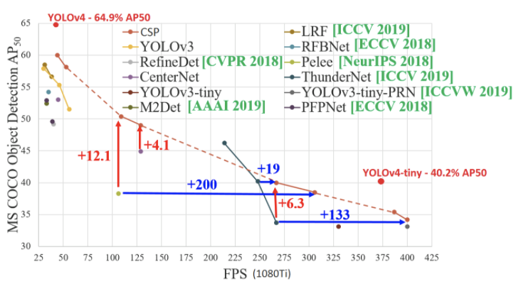

# Training a custom detector for mask detection using Yolov4-tiny

## Colab tutorial for training a custom Yolov4-tiny detector.

https://colab.research.google.com/drive/1hQO4nOoD6RDxdbz3C1YSiifTsyZjZpYm?usp=sharing

## My Medium article on this.

https://medium.com/@techzizou007/training-a-custom-detector-for-mask-detection-using-yolov4-tiny-darknet-b58be08c9593

## My YouTube video on this 

[Youtube Link](https://www.youtube.com)

## What is YOLOv4-tiny?

YOLOv4-tiny is proposed based on YOLOv4 to simple the network structure and reduce parameters, which makes it be suitable for developing on mobile and embedded devices. We can use YOLOv4-tiny for much faster training and much faster detection. It is the compressed version of YOLOv4. It has only two YOLO heads as opposed to three in YOLOv4. It is trained from 29 pre-trained convolutional layers.

The FPS (Frames Per Second) in YOLOv4-tiny is approximately eight times that of YOLOv4. However, the accuracy for YOLOv4-tiny is 2/3rds that of YOLOv4 when tested on the MS COCO dataset. 

The YOLOv4-tiny model achieves 22.0% AP (42.0% AP50) at a speed of 443 FPS on RTX 2080Ti, while by using TensorRT, batch size = 4 and FP16-precision the YOLOv4-tiny achieves 1774 FPS.

## **CREDITS**

   **References**
 
*    [Alexey AB GitHub ](https://github.com/AlexeyAB/darknet)

*    [pjreddie Github ](https://github.com/pjreddie/darknet)

*    [theAIGuysCode Github](https://github.com/theAIGuysCode/YOLOv4-Cloud-Tutorial) 

*    [Paper YOLOv4](https://arxiv.org/abs/2004.10934)

*    [Paper YOLOv4-scaled](https://arxiv.org/abs/2011.08036)

*    [pjreddie Site](https://pjreddie.com/darknet/yolo/)

   **Dataset Sources**

You can download datasets for many objects from the sites mentioned below. These sites also contain images of many classes of objects along with their annotations/labels in multiple formats such as the YOLO_DARKNET txt files and the PASCAL_VOC xml files.

*   [Open Images Dataset by Google](https://storage.googleapis.com/openimages/web/index.html)

*   [Kaggle Datasets](https://www.kaggle.com/datasets)

*   [Roboflow Public Datasets](https://public.roboflow.com/)

*   [VisualData Datasets](https://www.visualdata.io/discovery)

   **Mask Dataset Sources**

*   [Prajnasb Github](https://github.com/prajnasb/observations)

*   [Andrewmvd Kaggle](https://www.kaggle.com/andrewmvd/face-mask-detection)

*   [X-zhangyang Github](https://github.com/X-zhangyang/Real-World-Masked-Face-Dataset)

*   [Chandrikadeb7 Github](https://github.com/chandrikadeb7/Face-Mask-Detection)

   **Video Sources**
    
*   [Pexels site](https://www.pexels.com/)

